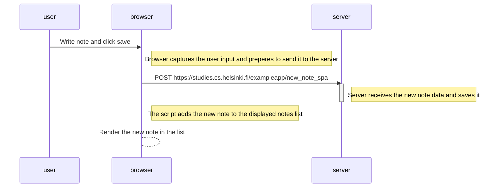

```mermaid
    sequenceDiagram
    participant user
    participant browser
    participant server

    user->>browser: Write note and click save
    Note right of browser: Browser captures the user input and preperes to send it to the server

    browser->>server: POST https://studies.cs.helsinki.fi/exampleapp/new_note_spa 
    activate server
    note right of server: Server receives the new note data and saves it
    deactivate server

    note right of browser: The script adds the new note to the displayed notes list
    browser-->browser: Render the new note in the list
```
